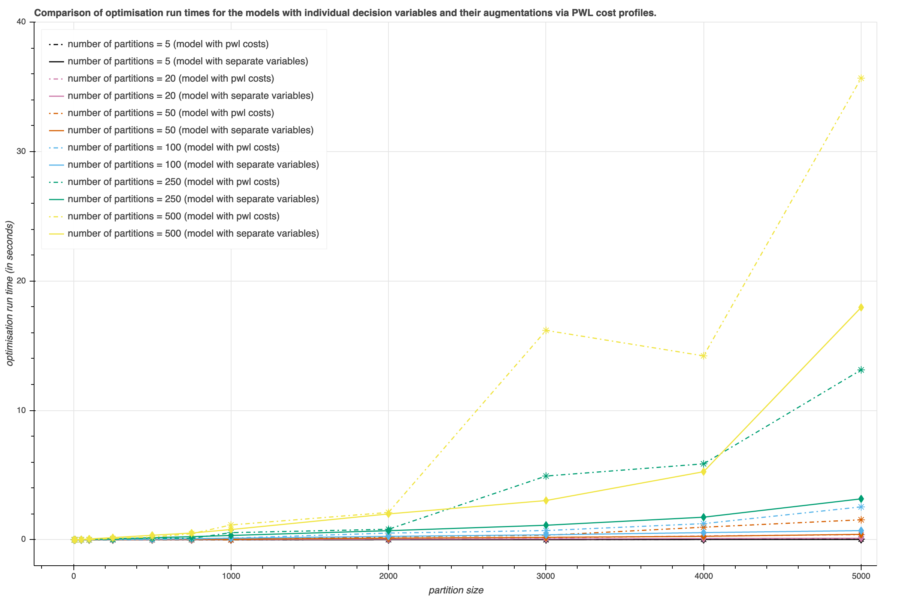
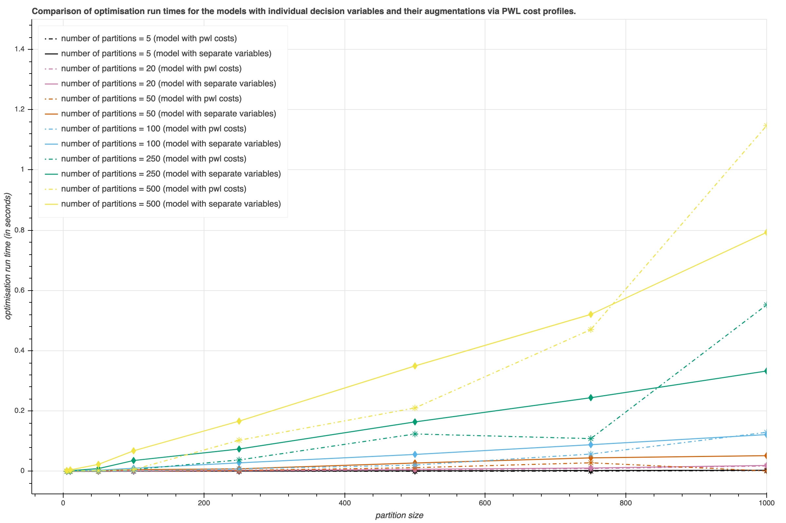
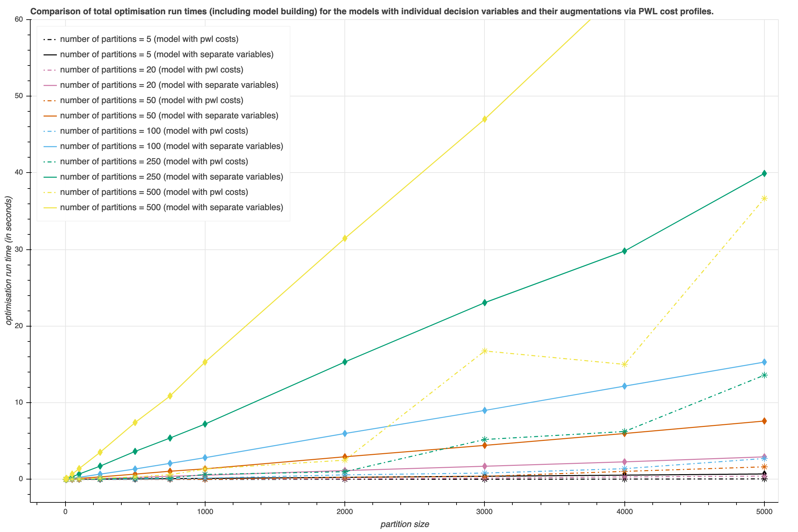
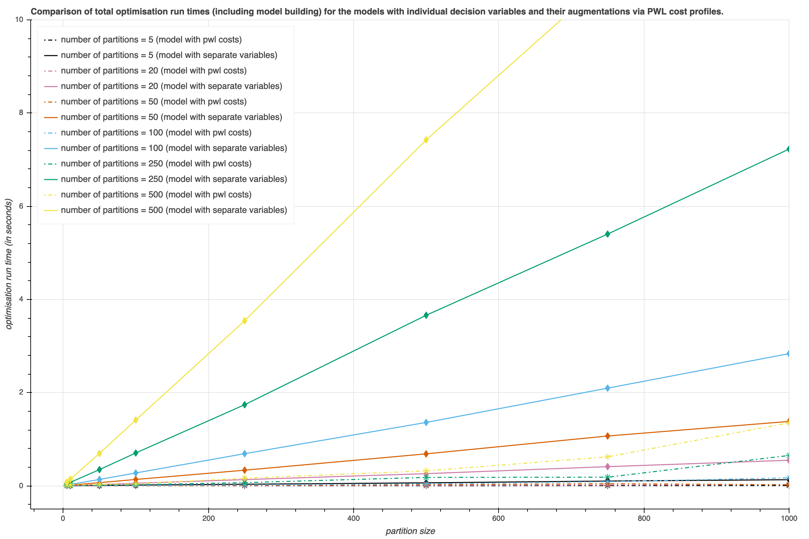

# Using piece-wise linear cost profiles versus individual variables: a study.
Gurobi allows one to describe piece-wise linear costs per decision variable using `setPWLObj`. This, however, is an interface to a modelling trick which involves describing `n` constraints and one additional auxiliary decision variable. Piece-wise linear cost profile for a decision variable on a partition of an interval can be described as a collection of individual decision variables on each of the sub-intervals of the partition, and the question of interest is how each of these two approaches scales and how they compare. The code in this repo describes and implements simple models designed to study the effect of model size and complexity on performance.

## Dependencies
* Python 3 (see `requirements.txt`)
* Gurobi 

Use `requirements.txt` in order to be able to run modelling experiments:

```
pip install requirements.txt
```
## Model(s) implemented
### Model A (individual variables)
Fix  and a partition  of reals between 0 and : 


Fix  and . Let  be a finite set of consecutive integers  and let  be its subsets, so that no two such subsets are the same.

Introduce continuous decision variables as follows: 

, , . 

Consider the following set of constraints:


Model A minimises function 

 

for some choice of weights , where sequence  is non-decreasing for each fixed .

### Model B (augmented variables with piece-wise linear costs)
Model B is equivalent to Model A and is obtained by augmenting decision variables as follows:

.

Same constraints apply as in model A and the objective function is as follows:

,

where costs  are calculated implicitly by the solver after passing PWL cost profiles for each variable  (as sequence  is non-decreasing for each fixed , it is guaranteed that the resulting cost profiles are convex).

## Multiple model instances
We generate multiple Model A and Model B instances by varying  and . The size of the problem is controlled by the set  and partition . Cost profiles are fixed for a given partition  and the number of its replications (size of set ).

## How to run experiments
```
python pwl.py
```
## Known bugs
1. Upon producing `results.csv` some table cell labels have suffix `_copy` - this needs to be removed prior to running `produce_graphs.py`; theis suffix is probably due to the need to repeatedly generate experiments until solvable model instances are obtained.

## How to analyse results
```
# the following will produce total run times (i.e. model building plus optimisation times)
python produce_graphs.py results.csv entire total_runtime
python produce_graphs.py results.csv shortened total_runtime

# the following will produce pure optimisation run times (i.e. model building times are left out)
python produce_graphs.py results.csv entire
python produce_graphs.py results.csv shortened
```

## Results





## Observations and preliminary conclusions
1. Pure optimisation run times depend both on the complexity (number of partition replications) and size of the model (main partition size). Pure optimisation run times for the models with augmented variables and PWL cost profiles outperform the model with individual variables for smaller values of the partition size, whereas larger problem sizes show the opposite effect.
2. Model building times, especially in the model instances with individual variables, have a dramatic effect on the total runtimes and show that augmentation with PWL cost profiles can be significantly faster. To emphasise, this effect is due to the time spent on building model instances with individual variables.
3. Note that model instances with individual variables are produced for arbitrary partitions. Model building times can be significantly improved by taking uniform partitions, so that each individual decision variable has the same domain. Albeit this is only a speculation, I suspect that will make total runtime comparable again.
4. Augmentation is not always possible. It is impossible to both have individual variables and their augmentations with PWL costs in Gurobi. Even when augmentation is possible, one should weigh up giving up the convenience of dealing with individual decision variables (e.g. in terms of dealing with the input data or interpreting the results). However, whenever augmentation is possible and the resulting cost profiles are ensured to be convex/concave, the transition is reasonably straightforward.
